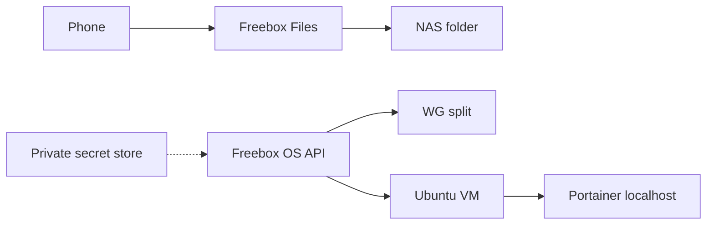

# grok-freebox-ultra-delta

Public procedures for a **Freebox Ultra or Delta** lab:

- Freebox OS API (authorize on LAN, session HMAC-SHA1)
- WireGuard **split** tunnel (never `0.0.0.0/0` on an agent host)
- Optional Ubuntu VM + Portainer on `127.0.0.1:9000`
- RAM profile for a ~2 GiB VM (zram + swappiness + Docker caps)
- Optional phone rushes → YouTube private (`yt-galaxy`)

**Git = docs + examples + scripts.**  
**Secrets stay off git.** See [SECURITY.md](SECURITY.md).

Grok Bot template text: [TEMPLATE-GROK-BOT.md](TEMPLATE-GROK-BOT.md)

## Install order

1. [Secrets](docs/01-secrets-drive.md)
2. [Freebox OS API](docs/02-freebox-api.md)
3. [WireGuard split](docs/03-wireguard-split.md)
4. [VM + Portainer + RAM](docs/08-vm-portainer-ram.md)
5. [Freebox Files](docs/00-freebox-files.md) (optional)
6. [oauth-traefik](docs/04-oauth-traefik.md) / [YouTube verify](docs/07-youtube-verification.md) (optional)

## Not in this repo

- Full-tunnel VPN
- WAN-exposed Portainer / SSH / Plex
- n8n
- Real tokens, keys, WAN IPs

## License

MIT — [LICENSE](LICENSE).
